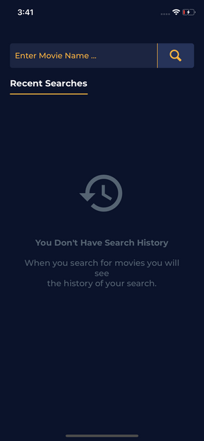
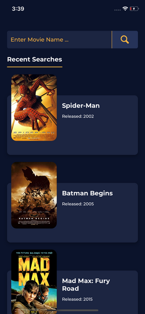
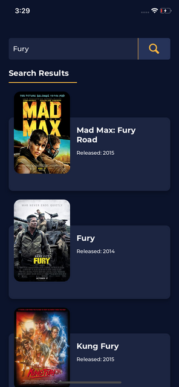
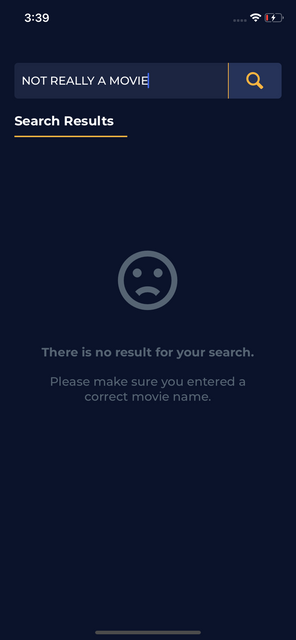
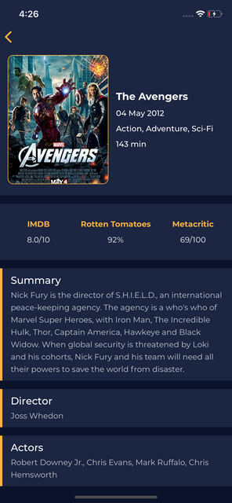

# React Native

## First Steps To perepare My Enviroment

- For Windows

  - Install Node.js v.14 or less
  - Install jdk v.15 or less
  - Install Android Studio for 'SDK' & 'Android Emulator'
  - Check System Variables

    ```
    JAVA_HOME:
      C:\Program Files\Java\jdk1.8.0_211

    ANDROID_HOME:
      C:\Users\[UserName]\AppData\Local\Android\Sdk
    ```

  - Create Emulator in Android Studio from 'AVD Manager'

- Create & install 'React Native' project
  > npx react-native init ReactNativeLabs
- Go to project folder
  > cd ReactNativeLabs
- Install React Native Vector Icons
  > npm i react-native-vector-icons
  > npx react-native link

### To Run the app on the Emulator

- Open the emulator
- In the app folder:
  > npm run android

### To install yarn

    npm i -g yarn

### To install node modules

    yarn

---

## Start Working on My App

- ### Steps to perepare my structure (design pattern)

  - Create 'src' folder
  - Move 'App.js' to 'src' folder
  - Rename 'App.js' to 'index.js'
  - Update 'App' path in outter 'index.js

- ### App Folders

  `In 'src' folder`

  - Common - for shared components ex. [fonts, styles, colors, ...]
  - Components - for app components
  - Screens - for app screens
  - Services - for services ex. [API recquests]

  `In 'myApp' folder` : Assets - for app assets ex. [fonts, images, ...]

- ### App Screens

  - Start Screen (no prev movie were pressed):

    

  - Start Screen (recent opened movies details):

    

  - Search Results Screen (Results were found):

    

  - Search Result Screen (Results were not found):

    

  - Movie Details Screen:

    

- ### App Components

  `In 'Search' Screen`

  - Search Bar
  - Title
  - Movie Card

  `In 'Movie Details' Screen`

  - Movie Card
